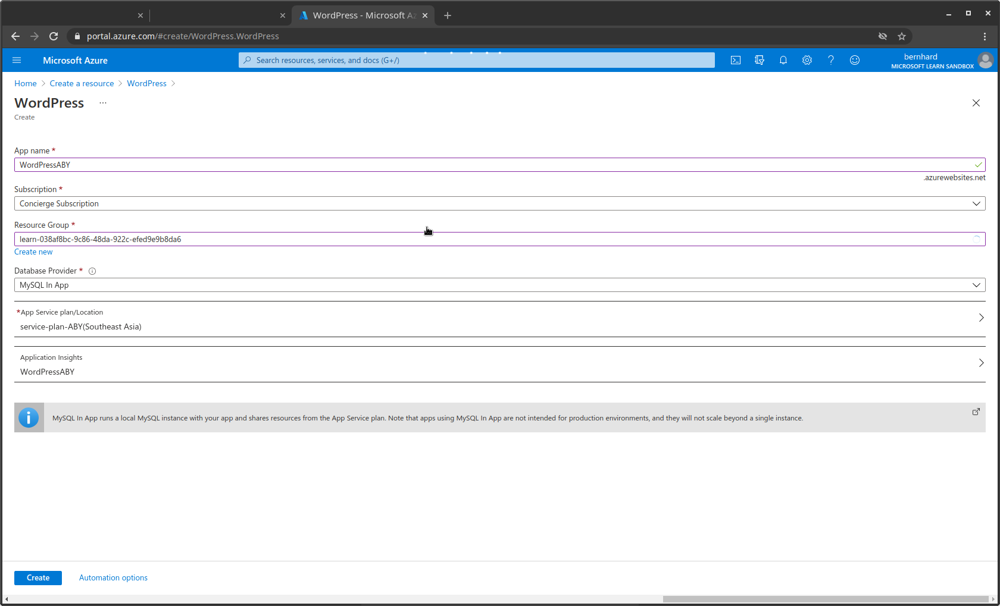
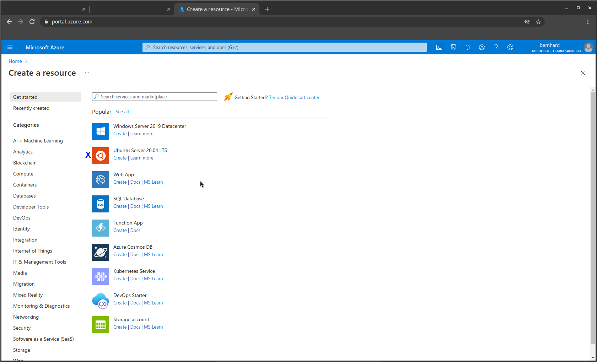
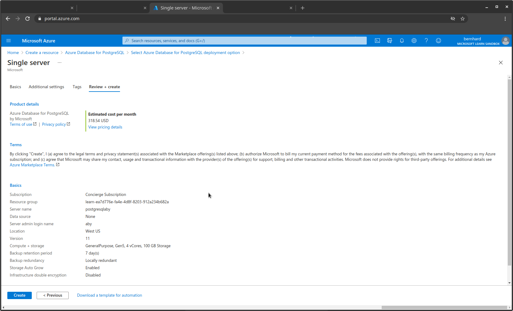
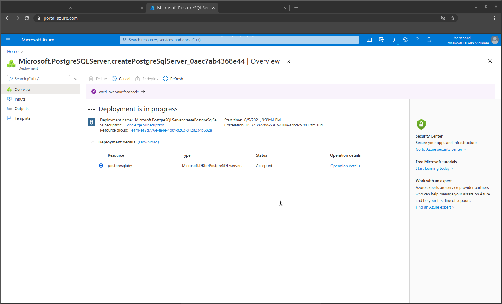
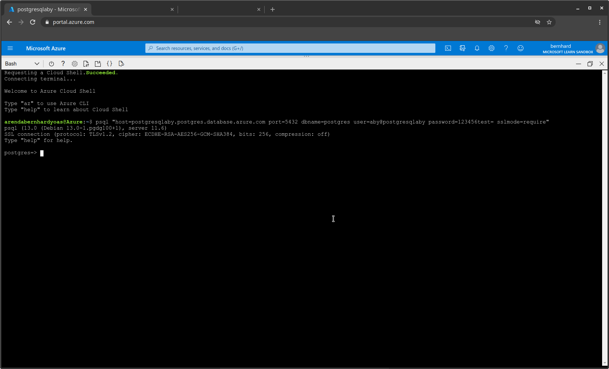
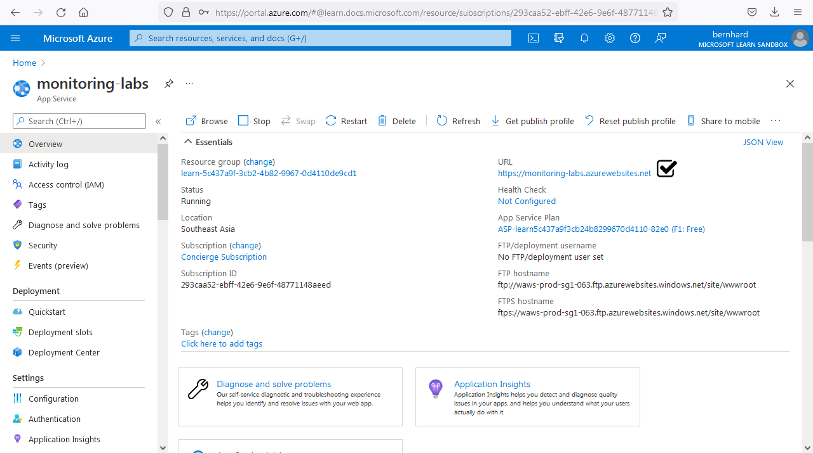
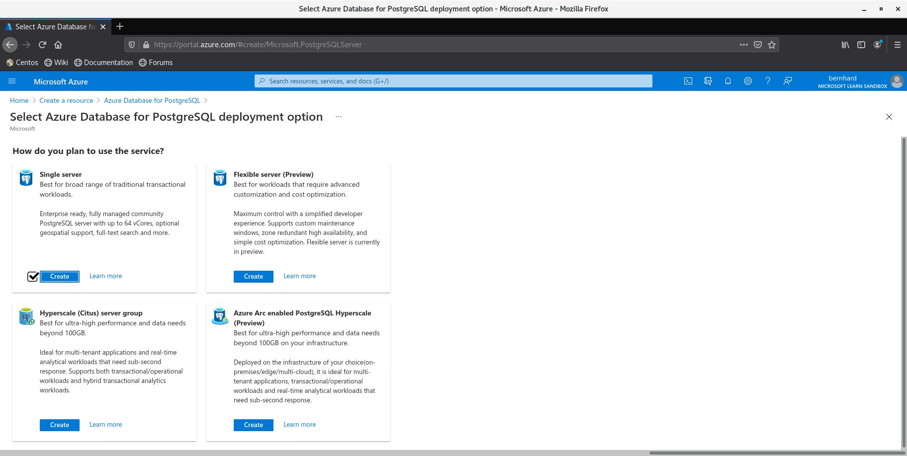
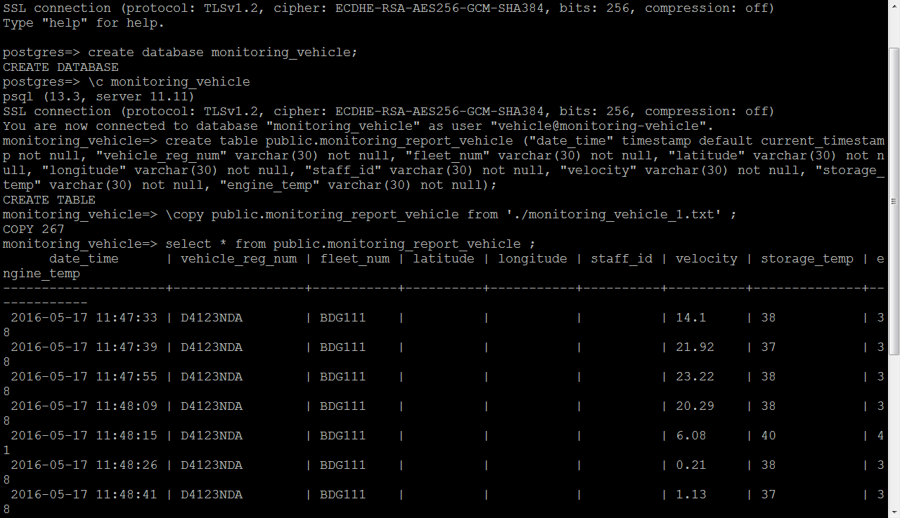

# Microsoft Azure

** **

## Azure App Service 

### Create WordPress Website

Create Azure App Service resource from Azure Portal 

Type “WordPress” on search services and marketplace box 

Type public url on web browser 

** **

## Azure Virtual Machine

### Linux Ubuntu SSH connection

Create Azure Virtual Machine resource from Azure Portal 

Choose and create “Ubuntu Server 20.04 LTS” from popular resources 

Connect to virtual machine via SSH with public IP address 
Install web server Type public IP address on web browser 

** **

## Azure Database

### Create and remote PostgreSQL

Create Azure Database resources from Azure Portal 

Type “Azure Database for PostgreSQL” on search services and marketplace box Select “Single server” for deployment option 

Create firewall rule in connection security setting for allow public IP access 

Firewall rule allow all public IP from `0.0.0.0` to `255.255.255.255` similar to `pg_hba.conf` remote connection address `0.0.0.0/0` 
Connection strings to connect the database 

** **

## Monitoring Laboratorium

### Web App (PHP runtime stack)

Create Azure App Service resource from Azure Portal 

Choose and create “Web App” from popular resources 

On Deployment Center choose GitHub as source 
Authorize GitHub account to connect repository 
GitHub repository [here](https://github.com/arendabernhardyoas/monitoring-laboratorium) 

### Web App (NodeJS runtime stack)

Create Azure App Service resource from Azure Portal 

Choose and create “Web App” from popular resources 

On Deployment Center choose GitHub as source 
Authorize GitHub account to connect repository 
GitHub repository [here](https://github.com/arendabernhardyoas/monitoring-laboratorium/tree/nodejs) 

### PostgreSQL

Create Azure Database resources from Azure Portal 

Type “Azure Database for PostgreSQL” on search services and marketplace box Select “Single server” for deployment option 

Create firewall rule in connection security setting for allow public IP access 

Firewall rule allow all public IP from `0.0.0.0` to `255.255.255.255` similar to `pg_hba.conf` remote connection address `0.0.0.0/0` 
Connection strings to connect the database 

`psql` connection strings to remote the database 
`PHP` connection strings to update database table (Web App using PHP runtime stack) 
`NodeJS` connection strings to update database table (Web App using NodeJS runtime stack) 
Create database table 

### Result

Type public url of Web App resource on web browser 

** **

## Monitoring Vehicle

### Web App (NodeJS runtime stack)

Create Azure App Service resource from Azure Portal 

Choose and create “Web App” from popular resources 

On Deployment Center choose GitHub as source 
Authorize GitHub account to connect repository 
GitHub repository [here](https://github.com/arendabernhardyoas/monitoring-vehicle) 

### PostgreSQL

Create Azure Database resources from Azure Portal 

Type “Azure Database for PostgreSQL” on search services and marketplace box Select “Single server” for deployment option 

Create firewall rule in connection security setting for allow public IP access 

Firewall rule allow all public IP from `0.0.0.0` to `255.255.255.255` similar to `pg_hba.conf` remote connection address `0.0.0.0/0` 
Connection strings to connect the database 

`psql` connection strings to remote the database 
`NodeJS` connection strings to update database table (Web App using NodeJS runtime stack) 
Create database table 

### Result

Type public url of Web App resource on web browser 

** **

